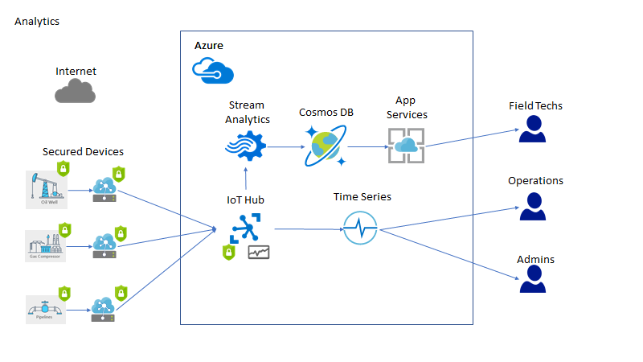
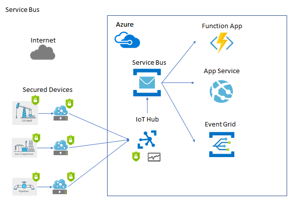
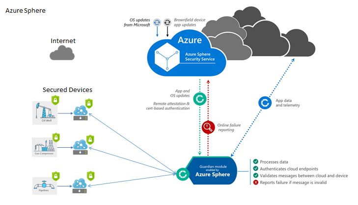

# Securing Azure IoT solutions hands-on lab step-by-step

## Abstract and learning objectives

In this hands-on-lab, you will implement an IoT solution that utilizes the latest Azure Security IoT features.  Specifically, you will provision a set of Azure resources that will securely manage your IoT infrastructure and devices.  This includes provisioning Azure IoT Edge devices with supporting modules and agents.

Once deployed and configured, you will simulate various events from the devices that will then generate specific alerts in the Azure Security Center for IoT.  You can then use these alerts to diagnosis issues with your devices and execute commands to remediate those issues.

At the end of this lab, you will have a better understanding of how the latest Azure Security features work with IoT environments as well as how to install, configure and troubleshoot issues.

## Overview

Contoso, Ltd. has major holdings in one of the world’s most important oil-producing regions. To overcome the challenges of monitoring and optimizing a vast number of widely dispersed field assets, Contoso, Ltd. is looking to streamline its operations with IoT solutions. They want to deploy IoT technologies to electronically collect data and use cloud-based solutions to store and analyze it in order to gain new insights into well operations and future drilling possibilities.

Their environments are very tough environments in which to work. The climate is hot, harsh, and unforgiving, and oil wells are often spaced many miles apart, so field technicians can spend much of their day just driving from one to another. Cellular and radio reception is spotty at best, so collecting data about well conditions and performance typically involves manually writing down information. The technician must then make the long trek to the central office at the end of the day to upload the data for analysis. With such remote situations, a key concern for Contoso is not only how they manage these remote devices, but more broadly how they secure the complete solution that encompasses the physical device, the software on the device, the services processing the data in the cloud and the network connecting it all.

Contoso plans to tie into existing sensors at the well head that monitor key system parameters like temperatures, pressures, and flow rates. They will deploy gateway devices to route device data for processing, storage and analytics. Internal IT staff and engineers want to visualize the high-resolution data and deliver near real-time analyses. The company is placing a premium on flexibility and ease of use, with security as a fundamental driver.

In addition, they would also like the solution to yield benefits to their workers in the field. “The field technicians and lease operators already have tools on their phones that they use every day to see what a well is doing,” explains Miles Strom. “Our goal is to connect these tools to live data from the IoT sensors. So, instead of seeing low-resolution volumes or flow rates, they’ll see what is happening in real time. This way they can respond immediately to problems that lead to downtime or maintenance issues.”

They have implemented a proof-of-concept solution for collecting and analyzing device telemetry using IoT Hub, but are interested in learning about any related services in Azure that would help them to secure such solutions.

## Solution architecture (High-level)

## Solution architecture (Analytics)

## Solution architecture (Data Processing)

## Solution architecture (Azure Sphere)

> **Note**: These labs focus solely on device security and do not explore analytics or data processing at depth. Stream Analytics and Service Bus are not presented in these labs. Additionally, you would need Azure Sphere hardware and connectivity to such devices in order to review full end to end (E2E) security components and topics such as highly secure remote upgrades. As such, you will not see these topics covered in these labs.

## Requirements

1. Microsoft Azure subscription must be pay-as-you-go or MSDN.

    - Trial subscriptions will not work.

## Before the hands-on lab

Refer to the Before the hands-on lab setup guide manual before continuing to the lab exercises.

> **Note**: As part of the deployment, both ports 3389 and 22 will be open on the Network Security Group.  It is advisable that you modify the NSG settings to only allow your internet IP to connect to those ports.
