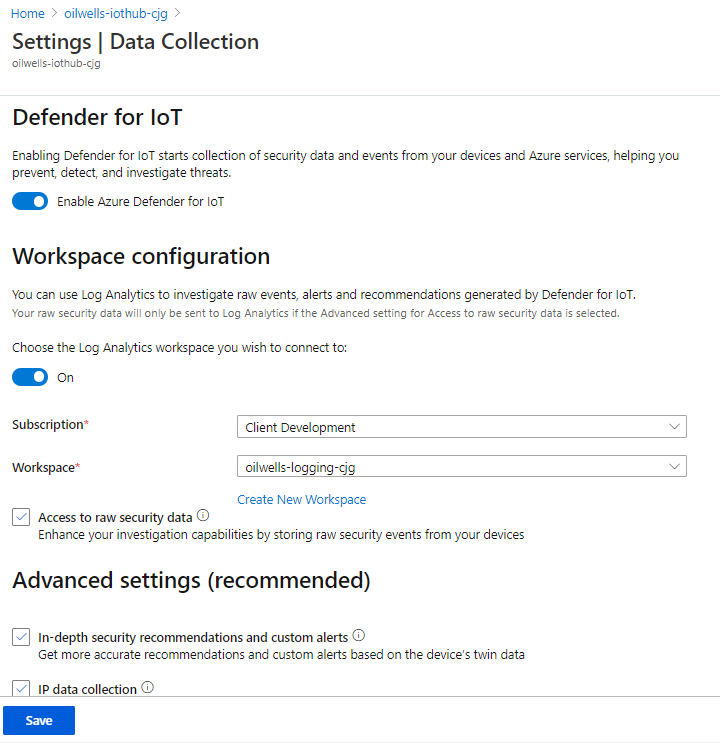

## Exercise 1: Secure and configure IoT Hub and Device Provisioning Service

Duration: 15 minutes

In this exercise you will link your provisioning service to your IoT Hub.  Once this is complete, you will enable the Azure Security Center for IoT on your IoT Hub.  With this plumbing in place, you can start to create your device enrollments and to provision your IoT devices.

You will also enable diagnostic logging such that you can create custom alerts later in this lab.

### Task 1: Link Device Provisioning Service to IoT Hub

1. Open the Azure Portal.

2. Browse to your lab resource group.

3. Select the **oilwells-prov-<inject key="DeploymentID" enableCopy="false"/>** device provisioning resource. 

4. In the Device Provisioning Service blade, under **Settings**, select **Linked IoT Hubs**.

5. Select **+Add**.

    

6. Select the **oilwells-iothub-[YOUR INITS]** IoT hub.

7. Select the **iotowner** access policy.

    

8. Select **Save**, your IoT Hub and Provisioning Service will now be linked.

### Task 2: Enable Azure Security Center for IoT

1. Navigate back to your resource group.

2. In the menu, select the **oilwells-iothub-<inject key="DeploymentID" enableCopy="false"/>** IoT Hub.

3. In the resource blade, scroll down to the **Security** section and select **Overview**.

4. In the overview area, select **Secure your IoT solution**.

    

5. Press **F5** and refresh the Security Overview page of your IoT Hub, you should now see the **Threat prevention** and **Threat detection** KPIs.

6. In the blade navigation, under **Security**, select **Settings**.

    

7. On the settings page, select the **Data Collection** link.

8. Ensure **Enable Azure Defender for IoT** is selected.

9. Toggle the switch for the log analytics to **On**.

10. For the workspace, select **oilwells-logging-<inject key="DeploymentID" enableCopy="false"/>**.

    

11. Select **Save**. Wait for the operation to complete.

### Task 3: Enable Azure Audit logging

1. Navigation back to your **iotsecurity-<inject key="DeploymentID" enableCopy="false"/>** resource group.

2. In the blade menu, select **Activity Log**.

3. In the top menu, select **Logs**.

    

4. Select the **diagnostic settings** link.

5. Select your lab subscription.

6. then select the **Add diagnostic setting** link.

7. For the name, type **iotsecuritylogging**.

8. Select all the checkboxes.

9. Select the **Send to Log Analytics** checkbox.

10. Select the **oilwells-logging-<inject key="DeploymentID" enableCopy="false"/>**.

11. In the top menu, select **Save**, this will send all Azure level configuration and diagnostic events to the Log Analytics workspace.

### Task 4: Configure diagnostic logging on IoT Hub

1. Navigate back to your resource group, select the **oilwells-iothub-<inject key="DeploymentID" enableCopy="false"/>** IoT hub.

2. In the blade menu, scroll to the **Monitoring** section, then select **Diagnostic settings**.

3. Select **Add diagnostic setting**.

    

4. For the name, type **oilwells-iothub-logging**.

5. Enable the **Send to Log Analytics** checkbox, and then select the **oilwells-logging-<inject key="DeploymentID" enableCopy="false"/>** workspace.

6. Enable all the `log` checkboxes and the `metric` checkbox.

    

7. Select **Save**.

### Task 5: Configure diagnostic logging on Device Provisioning Service

1. Navigate back to your resource group, select the **oilwells-prov-<inject key="DeploymentID" enableCopy="false"/>** IoT Device Provisioning Service.

2. In the blade menu, scroll to the **Monitoring** section, then select **Diagnostic settings**.

3. Select **Add diagnostic setting**.

4. For the name, type **oilwells-prov-logging**.

5. Enable the **Send to Log Analytics** checkbox, and then select the **oilwells-logging-<inject key="DeploymentID" enableCopy="false"/>** workspace.

6. Enable all the LOG checkboxes.

7. Select **Save**.

>**Note**:  It may take 5-10 minutes for event data to populate into the Log Analytics and then for Security Center recommendations to display.
