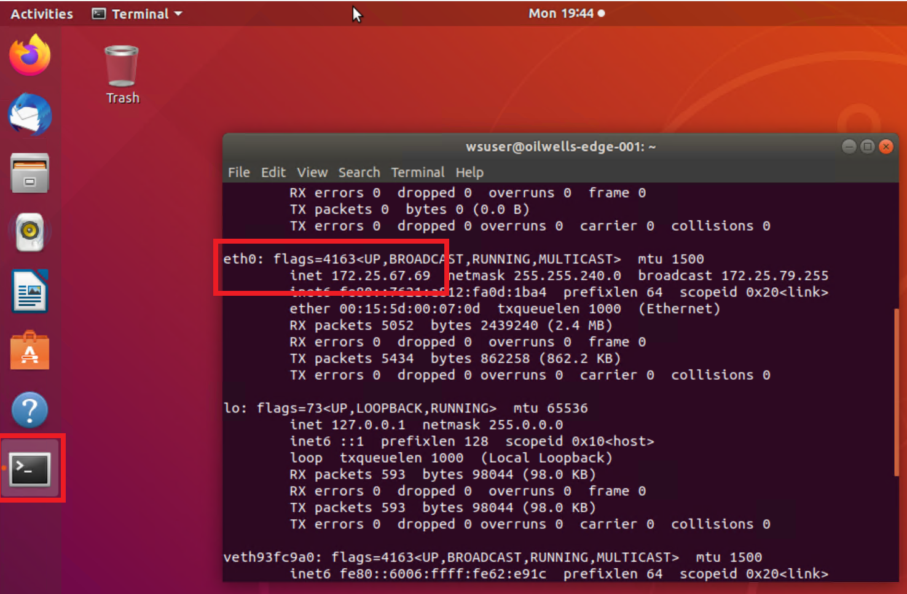

## Exercise 2: Enroll and provision IoT devices

Duration: 30 minutes

With the Azure resources in place, you can now start creating and provisioning devices into your Azure IoT Hub.  Here you will create several devices and configure them with the Azure IoT SDK, agents and modules to allow you to provision and utilize the security services offered by Azure.

### Task 1: Configure your devices

1. Inside the **oilwells-server-INIT** RDP session, open the Hyper-V console.

2. Select the **oilwells-edge-001** guest virtual machine.

    > **Note** It can take some time to download, unzip and mount the pre-created images so you may not see them show up immediately.

3. In the Hyper-V console, login to the VM using `wsuser` and password `S2@dmins2@dmin`

4. If prompted, select **Remind me Later** for upgrading the image.

5. Open a terminal window and run the following command:

    ```bash
    ifconfig
    ```

6. Record the `eth0` IP address.

    

7. From the Windows 10 virtual machine host, open a PowerShell window and run the following:

    ```PowerShell
    ssh wsuser@{IP ADDRESS}
    ```

8. If prompted, type **yes**, then enter the password.

9. In the new SSH window, run the following commands. This could take up to 10 minutes to complete. You are updating and upgrading as some required packages will requires these updates.

    - Depending on your hosting environment and command line tool (cmd.exe, bash, PowerShell, etc.), you may need to run each line one at a time to avoid skipping any commands.

    - Again, depending on your hosting environment, you may find it easier to download and run these in a [Putty](https://the.earth.li/~sgtatham/putty/latest/w64/putty-64bit-0.73-installer.msi) session.

    - The following commands may take 20-30 minutes to complete.

    > **Note**: You may want to open the [MCW GitHub HOL](https://github.com/microsoft/MCW-Securing-Azure-IoT-solutions/blob/master/Hands-on%20lab/HOL%20step-by%20step%20-%20Securing%20Azure%20IoT%20solutions.md) document in the virtual machine to copy/paste the commands easier.

   - For Ubuntu 18.04 (Lab default), note that you may need to reboot during some of the steps:

       ```PowerShell
       sudo apt-get install -y git cmake build-essential curl

       sudo apt-get install -y libcurl4 libcurl4-openssl-dev libssl-dev uuid-dev
       
       sudo apt-get install -y auditd audispd-plugins
       ```

   - For Ubuntu 16.04:

       ```PowerShell
       sudo apt-get install -y git cmake build-essential curl libcurl4-openssl-dev libssl-dev uuid-dev

       sudo apt-get install -y libcurl3
       sudo apt-get install -y auditd audispd-plugins
       ```

   > **Note**: Ubuntu 20.04 will not work with these labs.

10. Repeat the steps above for the **oilwells-d01** guest virtual machine. In order to SSH into the child device `oilwells-d01`, you will need to enable SSH. Open the Hyper-V window for the `oilwells-d01`, login using the lab username and credentials, open a terminal and run the following:

    ```Powershell
    sudo apt-get install -y openssh-server

    sudo nano /etc/ssh/sshd_config
    ```

    - Uncomment the `PasswordAuthentication yes` line

    ```Powershell
    sudo systemctl stop ssh
    sudo systemctl start ssh
    ```

### Task 2: Download and compile the Azure IoT SDK

1. On both virtual machines (**oilwells-d01** and **oilwells-edge-001**), run the following commands:

    > **Note**: You can find the latest release of the Azure IoT SDK [here](https://github.com/Azure/azure-iot-sdk-c/releases).  You can open the git to see what the latest release tag is (we reference `LTS_07_2020` below), but be aware the remainder of the lab may not work properly based on a new release.

    ```PowerShell
    sudo chown -R $USER:$USER /home/wsuser
    sudo rm -rf /var/certs

    git clone https://github.com/Azure/iotedge --recursive

    sudo git clone -b LTS_07_2020_Ref01 https://github.com/Azure/azure-iot-sdk-c --recursive

    cd azure-iot-sdk-c

    git submodule update --init
    ```

    Determine if you have a hardware-based TPM by running the following and observing if you get any results back.

    ```bash
    dmesg | grep -i tpm
    ```

    These labs are using the latest Azure Windows 10 images and VM Compute. You should see the Microsoft Virtual TPM displayed.

    

    If you are using a `hardware-based` image (which is the case with the pre-configured lab environment), then run the following command:

    ```PowerShell
    cmake -Duse_prov_client:BOOL=ON -Duse_tpm_simulator:BOOL=OFF .
    ```

    Otherwise with a `software-based` TPM, run the following:

    ```PowerShell
    cmake -Duse_prov_client:BOOL=ON -Duse_tpm_simulator:BOOL=ON .
    ```

    Whether software or hardware, setup the new registration and endorsement key tool by running the following:

    ```PowerShell
    cd provisioning_client/tools/tpm_device_provision

    make
    ```

### Task 3: Attempt device enrollment

1. On the `oilwells-edgevm-01` device, run the following commands:

    ```PowerShell
    sudo ./tpm_device_provision
    ```

    >**Note**:  This command will fail on a device that does not have a hardware or software TPM installed.  In order to utilize a hardware-based TPM, you would need an actual device with a TPM security chip, or a nested machine with a TPM enabled virtual machine running.  The Azure ARM template provisions an Azure VM Ubuntu image that does not have a hardware TPM enabled, nor does it have a software TPM installed.  However, the Windows 10 `server` image does have a Gen2 image setup that allows nested virtualization with a Hyper-V Virtual TPM installed.  As of 08/2021, a secured Azure Virtual Machine will surface as TPM, but it is not compatible with any of the current Azure IoT code/tools/software.

    

### Task 4: Install a software TPM and Resource Manager and reattempt device enrollment

 1. If you have a hardware TPM in your device the previous command would have succeeded and you can **skip to step 6**, again you can determine if you have a TPM device by running the following and observing if you get any results back.

    ```bash
    dmesg | grep -i tpm
    ```

    > **Note**: Devices such as a Raspberry PI do not come with a TPM chip.  You can however add a TPM chip to these devices such as [this Iridium Board](https://catalog.azureiotsolutions.com/details?title=OPTIGA-TPM-SLB-9670-Iridium-Board&source=all-devices-page/).

 2. Run the following commands to download, compile and start a software-based TPM server:

    ```PowerShell
    cd

    sudo wget -c https://phoenixnap.dl.sourceforge.net/project/ibmswtpm2/ibmtpm1332.tar.gz

    sudo tar -zxvf ibmtpm1332.tar.gz

    cd ..
    sudo chown -R $USER ~/.

    cd
    cd src
    sudo make

    ./tpm_server &
    ```

    > **Note**: Press Enter to continue entering commands.

    

 3. Run the following commands to start a TPM resource manager:

    ```PowerShell
    cd

    sudo apt-get install -y autoconf
    sudo apt-get install -y libtool
    sudo apt-get install -y pkg-config

    sudo wget -c https://netactuate.dl.sourceforge.net/project/ibmtpm20tss/ibmtss1.5.0.tar.gz

    sudo tar -zxvf ibmtss1.5.0.tar.gz

    cd ..
    sudo chown -R $USER ~/.

    cd

    sudo autoreconf -i
    ./configure --prefix=${HOME}/local --disable-hwtpm
    make
    make install

    cd local/bin
    ./tsspowerup &
    ./tssstartup &

    ```

    > **Note**: Press Enter after the tss commands to type more commands.

 4. With your hardware or software TPM running, attempt to provision again using the following commands:

    ```PowerShell
    cd
    cd azure-iot-sdk-c/provisioning_client/tools/tpm_device_provision
    sudo ./tpm_device_provision
    ```

    

 5. Copy the device **Registration Id** and the **Endorsement Key**.  Note that you may want to do this in the virtual machine rather than typing all the information.

    >**Note**: In the real world, all your devices should have hardware-based TPMs.

 6. Repeat the above steps on the **oilwells-d01** virtual machine in the Windows 10 host.

 7. In order to SSH into the child device, you will need to enable SSH. Switch to the Hyper-V for the `oilwells-d01` and run the following:

    ```Powershell
    sudo apt-get install -y openssh-server

    sudo nano /etc/ssh/sshd_config
    ```

    - Uncomment the `PasswordAuthentication yes` line

    ```Powershell
    sudo systemctl stop ssh
    sudo systemctl start ssh
    ```

### Task 5: Create IoT Hub Edge Device Enrollment

1. Switch to the Azure Portal and navigate to the **oilwells-prov-[YOUR INIT]** Device Provisioning Service.

2. Under **Settings**, select **Manage enrollments**.

3. Select **+Add Individual Enrollment**.

    

4. For the **Mechanism**, select **TPM**.

5. Enter your edge device Endorsement Key and Registration ID.

6. For the **IoT Hub Device ID**, type **oilwells-edge-001**.

    

7. Select the **True** toggle for the IoT Edge Device setting.

8. Select **Save**.

### Task 6: Create IoT Hub Device Enrollment

1. Repeat the previous steps to generate the registration ID and Key for the **oilwells-d01** guest virtual machine.

2. Switch to the Azure Portal and navigate to the **oilwells-prov-[YOUR INIT]** Device Provisioning Service.

3. Under **Settings**, select **Manage enrollments**.

4. Select **+Add Individual Enrollment**.

    

5. For the **Mechanism**, select **TPM**.

6. Enter your device Endorsement Key and Registration ID.

7. For the **IoT Hub Device ID**, type **oilwells-d01**.

8. Select the **False** toggle for the IoT Edge Device setting.

9. Select **Save**.
