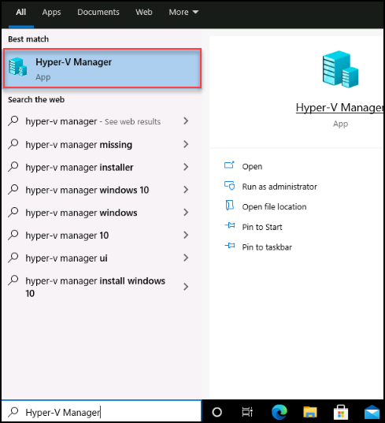
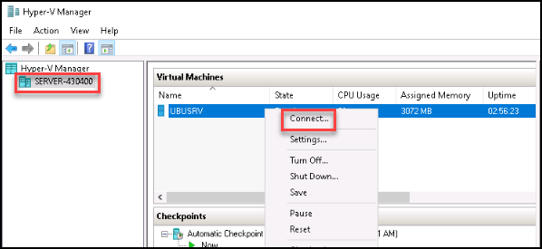
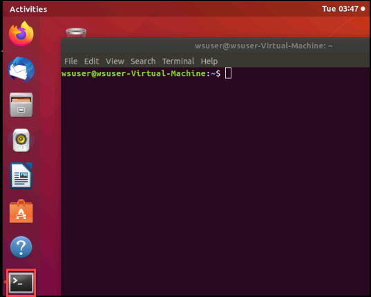
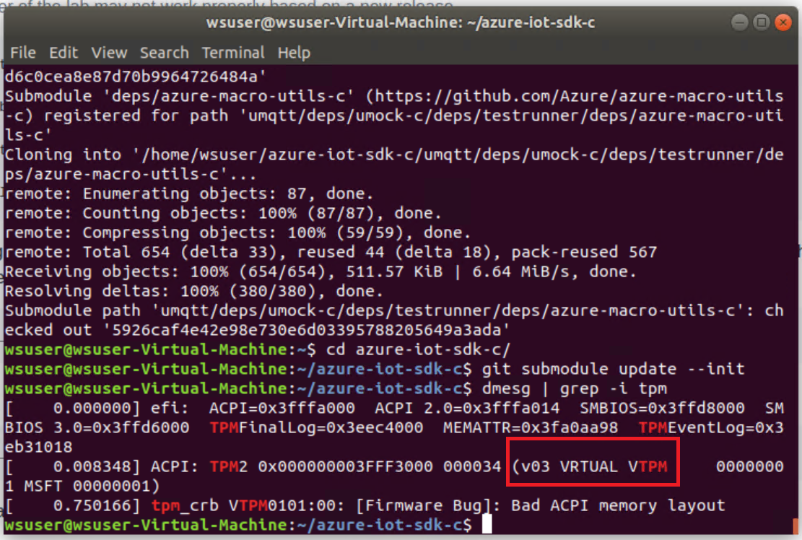

## Exercise 2: Enroll and provision IoT devices

Duration: 30 minutes

With the Azure resources in place, you can now start creating and provisioning devices into your Azure IoT hub.  Here you will create several devices and configure them with the Azure IoT SDK, agents and modules to allow you to provision and utilize the security services offered by Azure.

### Task 1: Configure your devices

1. Navigate to your LabVM Desktop.

2. Search for **Hyper-V Manager** in the Search Bar.
     

3. Open the **Hyper-V manager** , select the **server-<inject key="DeploymentID" enableCopy="false"/>** then select the `Ubuntu` image, start it if not started.

    > **Note**: If you do not see Hyper-V installed yet, the image is still being configured.  The VM will eventually reboot, and you will need to login again to see the pre-configured Ubuntu image.  You can find a status of the configuration in the `C:\WindowsAzure\Logs\CloudLabsCustomScriptExtension.txt` file.

    > **Note**: If the image does not display, you can manually execute the **MCW Setup Task** in the Task Scheduler, if for some reason that script will not download, you can manually download the Ubuntu image and install it into the Virtual Machine by executing the `\Hands-On lab\Scripts\post-install-script02.ps1` PowerShell script in the server image.

4. When the Hyper-V guest VM has started, right-click it and select **Connect**
    

5. If prompted, enter the password **S2@dmins2@dmin**.  You should now be logged into the device.

6. If prompted to upgrade to **20.04**, select **Don't Upgrade**.

### Task 2: Update and install Azure IoT SDK prerequisites

1. In the Hyper-V Ubuntu guest, open a `terminal` session. You should see a link in the right-hand favorites bar (you can also select the bottom right icon, then scroll down to the terminal application or search for terminal).
    

2. Run the following commands, this could take up to 10 minutes to complete.

    - Depending on your hosting environment and command line tool (cmd.exe, bash, PowerShell, etc.), you may need to run each line one at a time to avoid skipping any commands. You are updating and upgrading as some required packages will requires these updates.

    - Again, depending on your hosting environment, you may find it easier to download and run these in a [Putty](https://the.earth.li/~sgtatham/putty/latest/w64/putty-64bit-0.73-installer.msi) session.

    - The following commands may take 20-30 minutes to complete.

    > **Note**: You may want to open the [MCW GitHub HOL](https://github.com/microsoft/MCW-Securing-Azure-IoT-solutions/blob/master/Hands-on%20lab/HOL%20step-by%20step%20-%20Securing%20Azure%20IoT%20solutions.md) document in the virtual machine to copy/paste the commands easier.

- For Ubuntu 18.04 (Lab default), note that you may need to reboot during some of the steps:

    ```PowerShell
    sudo apt-get -y update
    sudo apt-get -y upgrade

    sudo apt-get install -y git cmake build-essential curl

    sudo apt-get install -y libcurl4 libcurl4-openssl-dev libssl-dev uuid-dev
    sudo apt-get install -y auditd audispd-plugins

    sudo reboot
    ```

- For Ubuntu 16.04:

    ```PowerShell
    sudo apt-get -y update
    sudo apt-get -y upgrade

    sudo apt-get install -y git cmake build-essential curl libcurl4-openssl-dev libssl-dev uuid-dev

    sudo apt-get install -y libcurl3
    sudo apt-get install -y auditd audispd-plugins

    sudo reboot
    ```

> **Note**: Ubuntu 20.04 will not work with these labs.

### Task 3: Download and compile the Azure IoT SDK

1. Wait for the server to reboot and SSH back into it, the password is **S2@dmins2@dmin**.

2. Run the following commands:

> **Note**: You can find the latest release of the Azure IoT SDK [here](https://github.com/Azure/azure-iot-sdk-c/releases).  You can open the git to see what the latest release tag is (we reference `LTS_07_2020` below), but be aware the remainder of the lab may not work properly based on a new release.

```PowerShell
git clone https://github.com/Azure/iotedge --recursive

git clone -b LTS_07_2020_Ref01 https://github.com/Azure/azure-iot-sdk-c.git --recursive

cd azure-iot-sdk-c

git submodule update --init
```

Determine if you have a hardware-based TPM by running the following and observing if you get any results back.

```bash
dmesg | grep -i tpm
```

For these labs, because we are using the latest Azure Windows 10 images and VM Compute, you should see the Microsoft Virtual TPM displayed:



If you are using a `hardware-based` simulator (which is the case with the pre-configured lab environment), then run the following command:

```PowerShell
cmake -Duse_prov_client:BOOL=ON -Duse_tpm_simulator:BOOL=OFF .
```

Otherwise with a `software-based` TPM, run the following:

```PowerShell
cmake -Duse_prov_client:BOOL=ON -Duse_tpm_simulator:BOOL=ON .
```

Whether software or hardware, setup the new registration and endorsement key tool by running the following:

```PowerShell
cd provisioning_client/tools/tpm_device_provision

make
```

### Task 4: Attempt device enrollment

1. Run the following commands:

```PowerShell
sudo ./tpm_device_provision
```

>**Note**:  This command will fail on a device that does not have a hardware or software TPM installed.  In order to utilize a hardware-based TPM, you would need an actual device with a TPM security chip, or a nested machine with a TPM enabled virtual machine running.  The Azure ARM template provisions an Azure VM Ubuntu image that does not have a hardware TPM enabled, nor does it have a software TPM installed.  However, the Windows 10 `server` image does have a Gen2 image setup that allows nested virtualization with a Hyper-V Virtual TPM installed.


### Task 5: Install a software TPM and Resource Manager and reattempt Device Enrollment

>**Note**: If you have a hardware TPM in your device the previous command would have succeeded and you can skip to step 4, again you can determine if you have a TPM device by running the following and observing if you get any results back.

```bash
dmesg | grep -i tpm
```

>**Note**: Devices such as a Raspberry PI do not come with a TPM chip.  You can however add a TPM chip to these devices such as [this Iridium Board](https://catalog.azureiotsolutions.com/details?title=OPTIGA-TPM-SLB-9670-Iridium-Board&source=all-devices-page/).

1. Run the following commands to download, compile and start a software-based TPM server:

    ```PowerShell
    cd

    sudo wget -c https://phoenixnap.dl.sourceforge.net/project/ibmswtpm2/ibmtpm1332.tar.gz

    sudo tar -zxvf ibmtpm1332.tar.gz

    cd ..
    sudo chown -R $USER ~/.

    cd
    cd src
    sudo make

    ./tpm_server &
    ```

    > **Note**: Press Enter to continue entering commands.

    

2. Run the following commands to start a TPM resource manager:

    ```PowerShell
    cd

    sudo apt-get install -y autoconf
    sudo apt-get install -y libtool
    sudo apt-get install -y pkg-config

    sudo wget -c https://netactuate.dl.sourceforge.net/project/ibmtpm20tss/ibmtss1.5.0.tar.gz

    sudo tar -zxvf ibmtss1.5.0.tar.gz

    cd ..
    sudo chown -R $USER ~/.

    cd

    sudo autoreconf -i
    ./configure --prefix=${HOME}/local --disable-hwtpm
    make
    make install

    cd local/bin
    ./tsspowerup &
    ./tssstartup &

    ```

    > **Note**: Press Enter after the tss commands to type more commands.

3. With your hardware or software TPM running, attempt to provision again using the following commands:

    ```PowerShell
    cd
    cd azure-iot-sdk-c/provisioning_client/tools/tpm_device_provision
    sudo ./tpm_device_provision
    ```

    

4. Copy the device **Registration Id** and the **Endorsement Key**.  Note that you may want to do this in the virtual machine rather than typing all the information.

    >**Note**: In the real world, all your devices should have hardware-based TPMs.

5. Switch to the Azure Portal and navigate to the **oilwells-prov-<inject key="DeploymentID" enableCopy="false"/>** Device Provisioning Service.

6. Under **Settings**, select **Manage enrollments**.

7. Select **+Add Individual Enrollment**.

    

8. For the **Mechanism**, select **TPM**.

9. Enter your Endorsement Key and Registration Id

10. For the **IoT Hub Device ID**, type **oilwells001**.

    

11. Select the **True** toggle for the IoT Edge Device setting.

12. Select **Save**.
