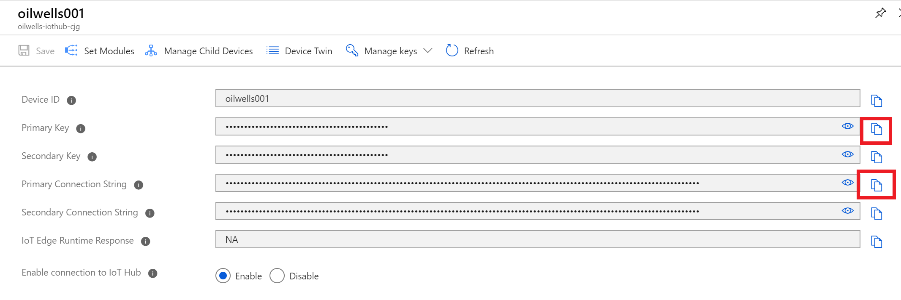
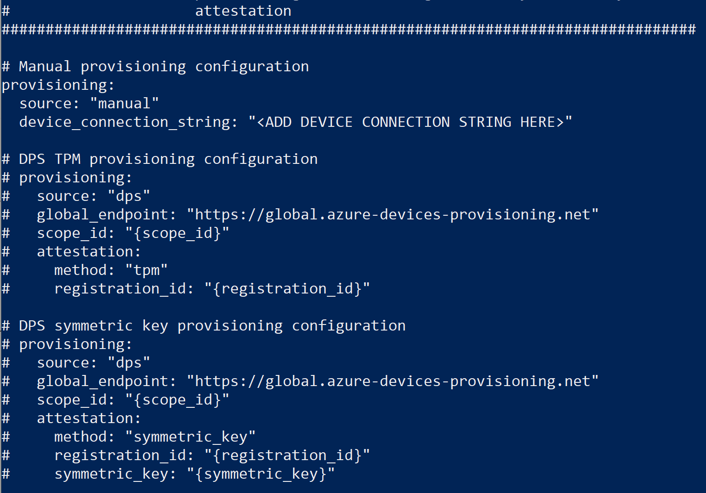
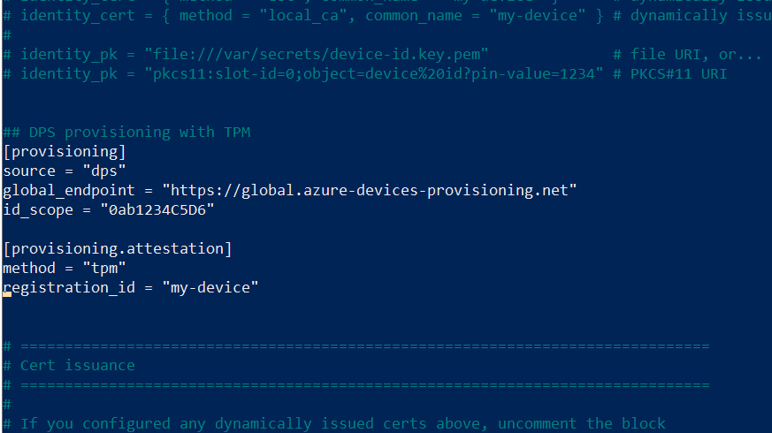
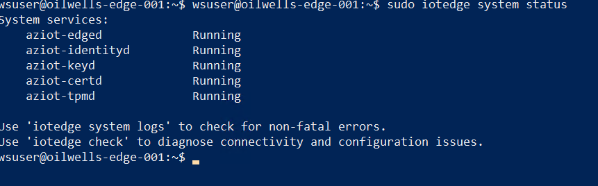

## Exercise 3: Install and configure IoT Edge

Duration: 30 minutes

In this exercise you will install the Azure IoT Edge agent on your IoT device and then register the new device with your IoT Hub.

>**Note**: You can download Ubuntu IoT Edge pre-installed virtual machine images in the Azure Marketplace.

### Task 1: Install IoT Edge

1. Switch back to your device terminal window for the **oilwells-edgevm-[YOUR INIT]** virtual machine, run the following command:

    >**Note**: Change the ubuntu version "os_version" as appropriate (`16.04` vs `18.04`).  You can get your version by running `lsb_release -a`.

    ```PowerShell
    cd

    curl https://packages.microsoft.com/config/ubuntu/{os_version}/multiarch/prod.list > ./microsoft-prod.list

    sudo cp ./microsoft-prod.list /etc/apt/sources.list.d/

    curl https://packages.microsoft.com/keys/microsoft.asc | gpg --dearmor > microsoft.gpg

    sudo cp ./microsoft.gpg /etc/apt/trusted.gpg.d/

    sudo apt-get update

    sudo apt-get install -y moby-engine
    ```

2. Choose **one of the agent paths** for your environment.  If you are new to the IoT Edge, then select the latest version path:

    `<=1.1.4`

    ```PowerShell
    sudo apt-get install iotedge
    ```

    `>=1.2`

    ```PowerShell
    sudo apt-get install aziot-edge
    ```

    > **Note**: Previous versions of this lab used a version of IoT Edge (`<=1.09`), but has since been upgraded to use `1.1.4` or later. The older path is included for reference.

### Task 2: Configure the IoT Edge agent

1. Switch to the Azure Portal, open your **oilwells-prov-[YOUR INIT]** device provisioning resource.

2. In the **Overview** blade, copy the **ID Scope**.

    

3. Navigate back to the resource group and open the **oilwells-iothub-[YOUR INIT]** IoT Hub.  

4. Under **Automatic Device Management**, select **IoT Edge**.

5. Select **+Add IoT Edge device**.

    

6. For the Device ID, type **oilwells-edge-001**.

    

7. Select **Save**.

    > **Note**: This step isn't necessary as the device provisioning service would create the device in the IoT Hub, but for the ease of flow of the lab, it is completed here.

8. Select the new **oilwells-edge-001** item, copy the primary key and primary device connection strings.

    

9. Switch back to your terminal window or SSH shell, run the following command to open a text editor:

    `<=1.1.4`

    ```PowerShell
    sudo nano /etc/iotedge/config.yaml
    ```

    `>=1.2`

    ```PowerShell
    sudo cp /etc/aziot/config.toml.edge.template /etc/aziot/config.toml

    sudo nano /etc/aziot/config.toml
    ```

10. Uncomment the line and edit the host name to be `oilwells-edge-001`.

11. There are several ways to register your device with the provisioning service.  This includes manually with a device connection string, TPM registration, and symmetric key.  

    The simplest provisioning method is "manual" with a device connection string.  Each way is presented below, you need **only pick one**.  Note that TPM registration requires a software or hardware TPM.  As of 08/2021, Trusted Platform in Azure will not work, but a nested VM inside a Hyper-V image (in the case of this lab, inside Windows 10) does and **TPM is the method you should choose**.

    >**Note**: YAML file structure formats are very specific.  Be sure that the leading lines have "tabs" that are made up of only 2 space characters.

    - Manual Provisioning

        - Using the device connection string you copied from above, paste it into the `config.yaml` or `config.toml` file:

        - `<=1.1.4`

            

        - `>=1.2.0`

            

        - Save the file, press **CTRL-X**, then **Y**, then **Enter**.

    - Symmetric Key Provisioning

        - Comment out the manual provision settings, uncomment the **DPS symmetric key** settings, then copy in the device primary symmetric key (you will have to change the device registration to this type) and Registration ID information.

        - Save the file, press **CTRL-X**, then **Y**, then **Enter**.

    - Certificate Provisioning

        - You will need to generate a test CA certificate and then device certificates.

        - On the `server-INIT` virtual machine, open a PowerShell  window, run the following.  Be sure to replace the IoT Hub name:

            ```PowerShell

            #https://github.com/Azure/azure-iot-sdk-c/blob/master/tools/CACertificates/CACertificateOverview.md

            #https://docs.microsoft.com/en-us/azure/iot-hub/iot-hub-x509ca-overview#sign-devices-into-the-certificate-chain-of-trust

            mkdir "c:\certs" -ea silentlycontinue

            cd "c:\certs"

            . "C:\LabFiles\azure-iot-sdk-c\tools\CACertificates\ca-certs.ps1"

            Test-CACertsPrerequisites

            #create the CA
            New-CACertsCertChain "rsa"

            $secPassword = ConvertTo-SecureString -String "S2@dmins2@dmin" -AsPlainText -Force;

            #create the device certs (oilwells-edge-001, oilwells002)
            New-CACertsEdgeDevice "oilwells-edge-001" -certPassword $secpassword

            Write-CACertsCertificatesForEdgeDevice "oilwells-edge-001"

            New-CACertsDevice "oilwells-d01" -certPassword $secpassword

            Write-CACertsCertificatesToEnvironment "oilwells-d01" {myIotHubName}

            New-CACertsDevice "oilwells-d02" -certPassword $secpassword

            Write-CACertsCertificatesToEnvironment "oilwells-d02" {myIotHubName}
            #>
            ```

    - TPM Provisioning

        - Comment out the manual provision settings, uncomment the **dps TPM** settings, then copy in the ID Scope and Registration ID information:

            

        - Although we are using a software TPM, when using a hardware TPM, you would need to give permissions to the hardware TPM to the iotedge service by running the following commands:

        - Save the file, press **CTRL-X**, then **Y**, then **Enter**.

        ```PowerShell
        tpm0=$(sudo find /sys -name dev -print | fgrep tpm0 | sed 's/.\{4\}$//')
        tpmrm0=$(sudo find /sys -name dev -print | fgrep tpmrm0 | sed 's/.\{4\}$//')

        sudo touch /etc/udev/rules.d/tpmaccess.rules
        ```

        - Run the following command to open a text editor:

        ```PowerShell
        sudo nano /etc/udev/rules.d/tpmaccess.rules
        ```

        - Replace the file with the following lines and then save the file:

        `<=1.1.4`

        ```PowerShell
        # allow iotedge access to tpm0
        KERNEL=="tpm0", SUBSYSTEM=="tpm", OWNER="iotedge", GROUP="iotedge", MODE="0660"
        KERNEL=="tpmrm0", SUBSYSTEM=="tpmrm", OWNER="iotedge", GROUP="iotedge", MODE="0660"
        ```

        `>=1.2`

        ```PowerShell
        # allow iotedge access to tpm0
        KERNEL=="tpm0", SUBSYSTEM=="tpm", OWNER="aziottpm", GROUP="aziottpm", MODE="0660"
        KERNEL=="tpmrm0", SUBSYSTEM=="tpmrm", OWNER="aziottpm", GROUP="aziottpm", MODE="0660"
        ```

        - Execute the following:

        ```PowerShell
        /bin/udevadm trigger $tpm0
        /bin/udevadm trigger $tpmrm0
        ```

        - Reboot the device/machine.

        ```PowerShell
        sudo reboot
        ```

        - Login and re-open the terminal.
        - Check that access has been applied:

        ```bash
        ls -l /dev/tpm0
        ls -l /dev/tpmrm0
        ```

        - You should see something similar to the following, ensure that `iotedge` or `aziottpm` is displayed depending on your IoT Edge version:

        ```bash
        crw-rw---- 1 iotedge iotedge 10, 224 Jul 20 16:27 /dev/tpm0
        ```

12. After completing **one** of the above methods, run the following commands to restart the iotedge service:

    - `<=1.1.4`

        ```bash
        sudo systemctl restart iotedge
        sudo systemctl status iotedge
        ```

        You should see the iotedge client status as **active (running)**.  Press **Ctrl-C** to exit the status message.

        

        > **Note**: If you do not see **active (running)**, then run the following command to see diagnostics logs that may help you troubleshoot the issue:

        ```PowerShell
        sudo journalctl -u iotedge -e
        ```

    - `>=1.2`

        ```bash
        sudo iotedge config apply

        sudo iotedge system status
        ```

        You should see the iotedge services all display **Running**.

        

        > **Note**: If you do not see **active (running)**, then run the following command to see diagnostics logs that may help you troubleshoot the issue:

        ```PowerShell
        sudo iotedge check
        ```

13. After the above configurations, the IoT Edge modules will be downloaded and created in docker containers. You can review the docker images by running the following command (it may take a few minutes for them to initialize on first start):

    ```PowerShell
    sudo docker ps
    ```

    
