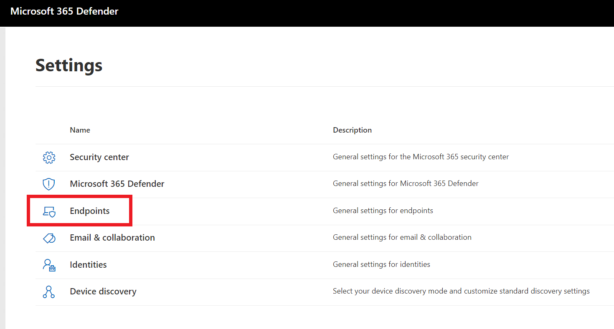
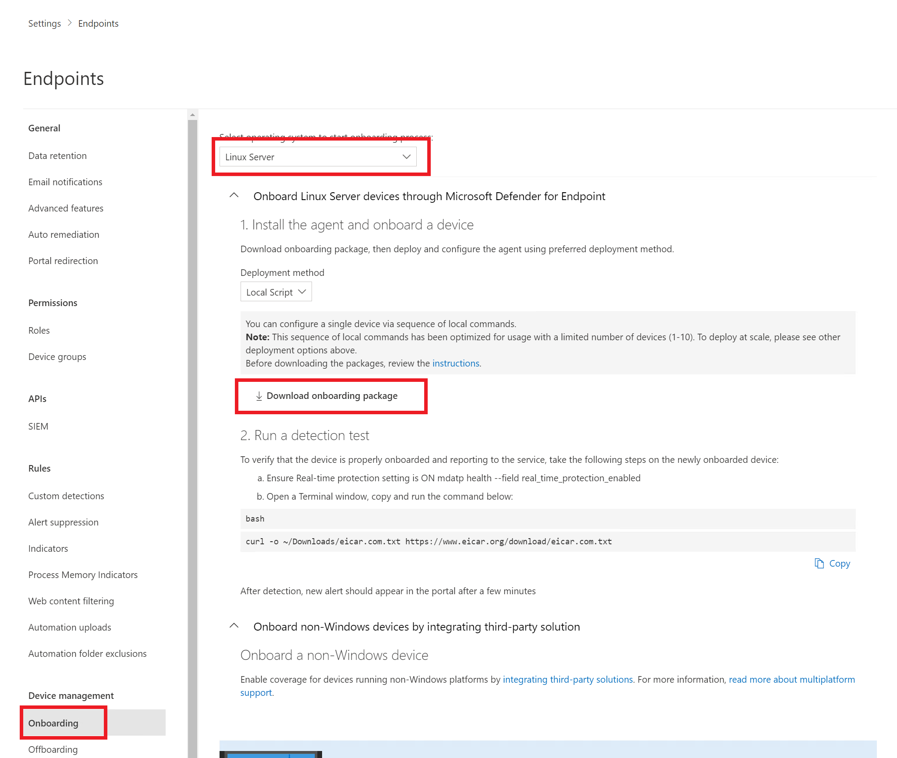

## Exercise 5: Microsoft Defender for Endpoint (Linux) - (Optional)

This optional exercise requires you to configure and enable Microsoft Defender for Endpoint in your tenant which is outside the scope of this workshop/lab.

### Task 1: Install the Microsoft Defender for Endpoint Agent

1. Switch to the **oilwells-edge-01** device, run the following commands, be sure to replace `{os_version}`:

    ```PowerShell
    cd

    sudo apt-get install curl

    sudo apt-get install libplist-utils

    sudo apt-get install gpg

    sudo apt-get install apt-transport-https
    
    sudo apt-get install mdatp
    ```

2. Switch to the [Microsoft Defender Portal](https://security.microsoft.com).

3. Select **Settings**.

4. Select **Endpoints**.

    

5. Under **Device management**, select **Onboarding**.

6. In the dropdown, select **Linux Server**.

7. Select **Download onboarding package** to download the zip package.  Once it is downloaded, unzip it.

    

8. Open the `MicrosoftDefenderATPOnboardingLinuxServer.py` file, copy its contents to your IoT Device:

    ```PowerShell
    sudo nano MicrosoftDefenderATPOnboardingLinuxServer.py
    ```

9. Run the following commands to configure the agent:

    ```PowerShell
    sudo apt-get install python
    
    python MicrosoftDefenderATPOnboardingLinuxServer.py
    ```

10. Verify it is running:

    ```PowerShell
    mdatp health --field real_time_protection_enabled
    ```
