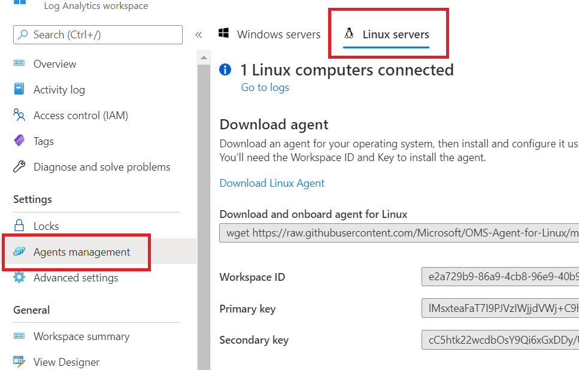
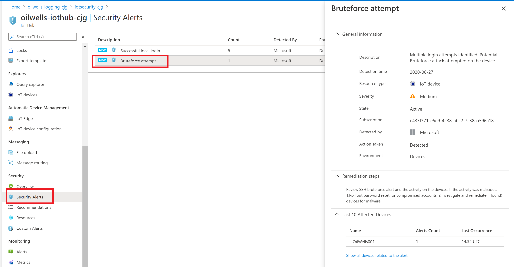

## Exercise 5: Simulate IoT attacks

Duration: 10 minutes

This exercise will have you install some "fake" processes and open some non-standard ports on your IoT device.  Once your attacks have been executed, the Security Agent will pick up these bad configurations and send them to the IoT Hub and the Azure Security Center will notify you.

### Task 1: Setup and execute attack scripts

1. Run the following command:

    ```bash
    sudo apt-get install -y netcat
    ```

2. Download and execute the attack script:

    ```bash
    cd

    git clone https://github.com/Azure/Azure-IoT-Security --recursive

    cd Azure-IoT-Security/trigger_events

    sudo chmod +x trigger_events.sh

    sudo ./trigger_events.sh --exploit

    sudo ./trigger_events.sh --malicious
    ```

    > **Note**: Feel free to explore the trigger events scripts and its different options : https://github.com/Azure/Azure-IoT-Security/tree/master/trigger_events.

### Task 2: Configure Azure Agent

1. In the Azure Portal, browse to your **iotsecurity-INIT** resource group, then select the **oilwells-logging-INIT** Log Analytics Workspace.

2. In the blade, select **Agents Management**.

3. Record the `Workspace ID` and the `Primary key` values.

4. Run the following commands, be sure to replace the workspace tokens with the values you records above:

    ```bash
    cd

    wget https://raw.githubusercontent.com/Microsoft/OMS-Agent-for-Linux/master/installer/scripts/onboard_agent.sh && sh onboard_agent.sh -w <YOUR_WORKSPACE_ID> -s <YOUR_WORKSPACE_KEY>

    sudo /opt/microsoft/omsagent/bin/service_control restart <YOUR_WORKSPACE_ID>

    ```

5. Switch back to the Azure Portal.

6. In the blade menu, select **Agents Management** and then select **Linux Servers**, you should see **1 LINUX COMPUTER CONNECTED**.

    

7. Under **Workspace Data Sources**, select **Virtual Machines**.

8. Select the **oilwells-edgevm-INIT**.

9. Select **Connect**.

    > **Note**: It may take a few minutes for the OMS logs to show up and a heartbeat to be registered in Log Analytics for the IoT Linux machine.

### Task 3: Perform brute force attack (Optional)

1. Repeat the above steps you have learned to add the **oilwells-edgevm-INIT** to the device provisioning service and the Iot Hub as **oilwells002**.  This would include most of the tasks in Exercise 2:

   - Install all the necessary SDK pre-reqs
   - Install the Azure IoT SDK
   - Register the device using one of the provisioning methods (connection string, symmetric key, TPM, certificate, etc)

2. In the server virtual machine, open a new PowerShell ISE window.

3. Browse to the `\Hands-on-lab\Scripts\BruteForce.ps1` script.

4. Update the script with the IP address of the **oilwells-edgevm-INIT** device.  You can get the IP from the Azure Portal.

5. Press **F5** to run the script. The script will attempt to login to the iot device using the wrong credentials with the plink tool of Putty.

    > **Note**: If the putty version has changed, the script will need to be updated. Browse to [here](https://the.earth.li/~sgtatham/putty/0.74/w64/) to find the latest version.

6. Eventually Azure Security Center will send an email warning of a brute force attack on your IoT Device.

    - Browse to the IoT Hub then under the Security section, select **Alerts**.

    - You should see the brute force alert displayed.

    

    > **Note**: We could not do this task on the device in the Windows 10 HyperV as it is not accessible to the HyperV host or from the internet.
