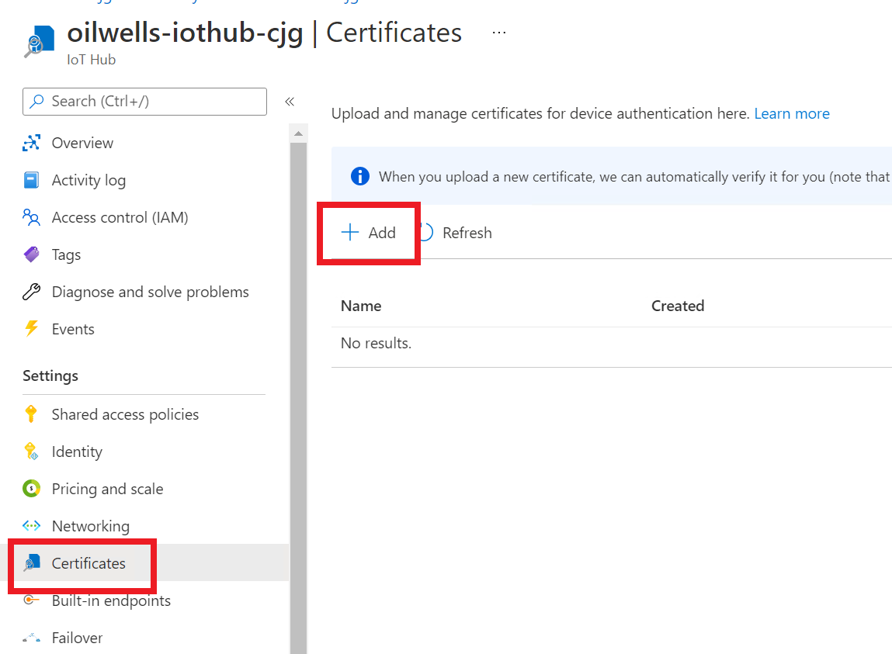
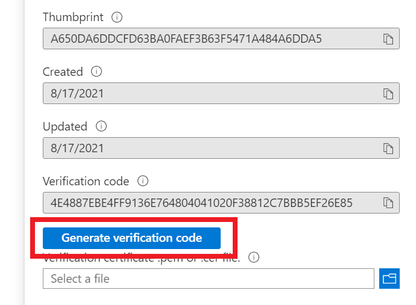
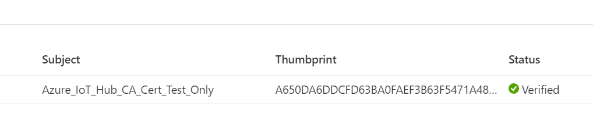
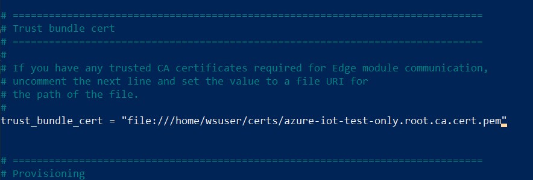
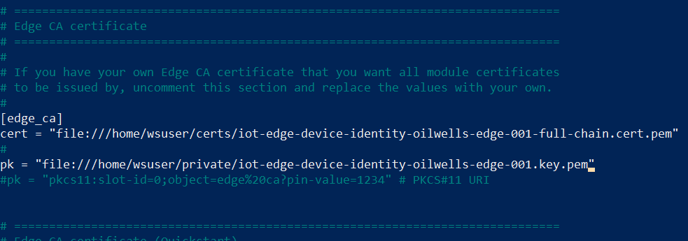
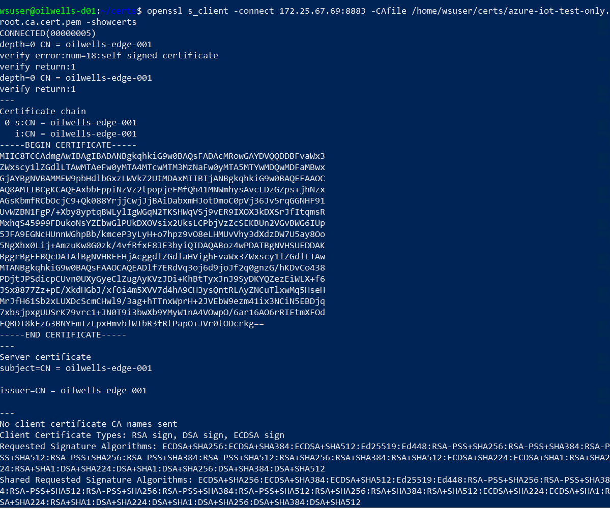
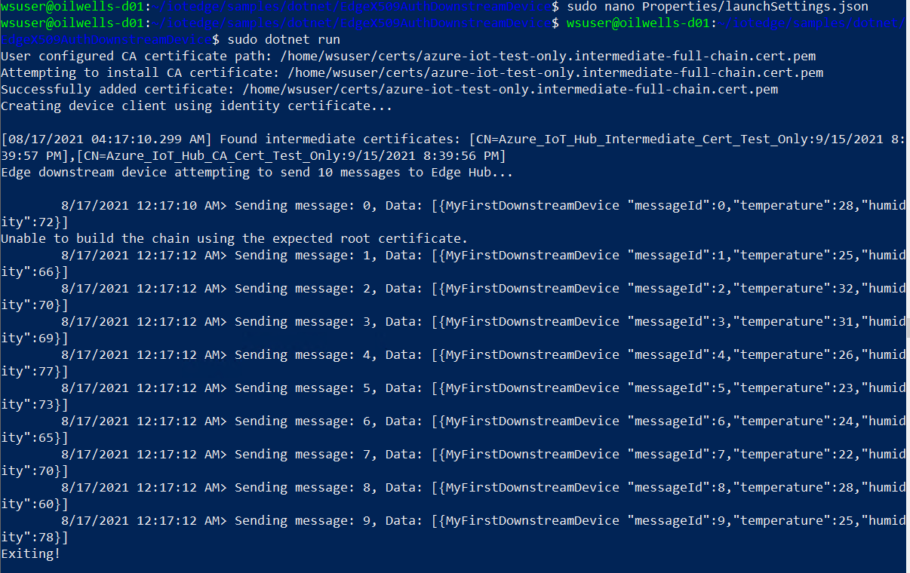

## Exercise 6: Setup Device to Edge Device Communication

Duration: 30 minutes

In this exercise you will setup a device to edge device communication channel.

### Task 1: Create Device Certificates

1. Switch to the **oilwells-edge-01** device SSH session.
2. Run the following commands:

    ```Powershell
    cd 

    #git clone https://github.com/Azure/iotedge.git

    cp iotedge/tools/CACertificates/*.cnf .
    cp iotedge/tools/CACertificates/certGen.sh .

    ./certGen.sh create_root_and_intermediate

    ./certGen.sh create_edge_device_identity_certificate "oilwells-edge-001"

    ./certGen.sh create_edge_device_ca_certificate "oilwells-ca"

    ./certGen.sh create_device_certificate "oilwells-d01-primary"
    ./certGen.sh create_device_certificate "oilwells-d01-secondary"
    ```

### Task 2: Upload and Verify Root CA to IoT Hub

1. Run the following command:

    ```PowerShell
    sudo nano /home/wsuser/certs/azure-iot-test-only.root.ca.cert.pem
    ```

2. Copy the text in the file to a machine that can be used to upload via browser.
3. Switch to the Azure Portal, browse to the IoT Hub.
4. Under **Settings**, select **Certificates**.
5. Select **Add**.

    

6. For the name, type **oilwells-ca**.
7. Select the .pem file.
8. Select **Save**.
9. Select the new certificate, then select **Generate verification code**.

    

10. Copy the verification code and run the following in the SSH session:

    ```PowerShell
    ./certGen.sh create_verification_certificate "<verification code>"

    ./certGen.sh create_device_certificate "oilwells-d01"
    ```

11. Run the following, again copy the text into a file that can be used to upload.

    ```PowerShell
    sudo nano /home/wsuser/certs/iot-device-verification-code-full-chain.cert.pem
    ```

12. In the Azure Portal, select to upload the new verification certificate.
13. Select **Verify**, you should now see the certificate is verified.

    

14. In the `oilwells-edge-001` SSH session, run the following command to copy the certs to the child device `oilwells-d01`, be sure to replace the `{DEVICE_IP}` value:

    ```PowerShell
    scp -r /home/wsuser/certs wsuser@{DEVICE_IP}:/home/wsuser
    scp -r /home/wsuser/private wsuser@{DEVICE_IP}:/home/wsuser
    ```

    >**Note** In production you would not copy all of these files to a downstream device.

### Task 3: Setup Edge Device

1. Run the following commands to update the certificates on both devices `oilwells-edge-001` and `oilwells-d01`:

    ```PowerShell
    sudo cp /home/wsuser/certs/azure-iot-test-only.root.ca.cert.pem /usr/local/share/ca-certificates/azure-iot-test-only.root.ca.cert.pem.crt
    sudo update-ca-certificates
    ```

2. On the `oilwells-edge-001` device, run the following to edit the IoT Edge configuration:

    - `<=1.1.4`

        ```PowerShell
        sudo nano /etc/iotedge/config.yaml
        ```

        - Uncomment and update the `X.509` section by uncommenting the lines.  Set the values to the following:

        ```PowerShell
        certificates;
        device_ca_cert: "/home/wsuser/certs/iot-edge-device-identity-oilwells-edge-001-full-chain.cert.pem"
        device_ca_pk: "/home/wsuser/private/iot-edge-device-identity-oilwells-edge-001.key.pem"
        trusted_ca_certs: "/home/wsuser/certs/azure-iot-test-only.root.ca.cert.pem"
        ```

   - `>=1.2`

        ```PowerShell
        sudo nano /etc/aziot/config.toml
        ```

       - Uncomment and update the values and section by uncommenting the lines and setting the values to the following:

        ```PowerShell
        trust_bundle_cert = "file:///home/wsuser/certs/azure-iot-test-only.root.ca.cert.pem"
        ```

        

        ```PowerShell
        [edge_ca]
        cert = "file:///home/wsuser/certs/iot-edge-device-identity-oilwells-edge-001-full-chain.cert.pem"                
        pk = "file:///home/wsuser/private/iot-edge-device-identity-oilwells-edge-001.key.pem"             
        ```

        

3. Save and close the file.
4. Run the following to restart the IoT Edge service:

    - `<=1.1.4`

    ```PowerShell
    sudo systemctl restart iotedge
    ```

    - `>=1.2`

    ```PowerShell
    sudo iotedge config apply
    ```

5. Be sure to open the firewall ports:

    ```bash
    sudo ufw allow 8883/tcp
    ```

6. If you have issues, run the following:

    - `<=1.1.4`

    ```PowerShell
    sudo journalctl -u iotedge
    ```

    - `>=1.2`

    ```PowerShell
    sudo iotedge system status
    ```

7. When running your IoT Edge device in Azure, you would need to open up NSG port access:

   - Switch to the Azure Portal.
   - Browse to your lab resource group.
   - Select the **oilwells-nsg-INIT** network security group.
   - Select **Inbound Security Rules**, then select **Add**.
   - For the destination port, type **8883**.
   - For the name, type **Port_8883**.
   - Select **Apply**.

### Task 4: Setup Device

1. Switch to the **oilwells-d01** device SSH session.

2. Run the following commands to get the SHA1 fingerprints on the device cert files:

    ```PowerShell
    cd certs

    openssl x509 -in iot-device-oilwells-d01-primary.cert.pem -text -fingerprint | sed 's/[:]//g'
    
    openssl x509 -in iot-device-oilwells-d01-secondary.cert.pem -text -fingerprint | sed 's/[:]//g'
    ```

3. Record each of the fingerprints, then switch to the Azure Portal.
4. Browse to the IoT Hub.
5. Under **Explorers**, select **IoT devices**.
6. Select **+Add device**.
7. For the **Device ID**, type **oilwells-d01**
8. For the authentication type, select **X.509 Self Signed**.
9. Paste the primary and secondary fingerprints you records above.
10. Select **Set a parent device**.
11. Select the **oilwells-edge-001** device.
12. Select **OK**.
13. Select **Save**.

14. Switch to the `oilwells-d01` device, run the following command to open the HOSTS file:

    ```PowerShell
    sudo nano /etc/hosts
    ```

15. Add the following to the hosts file, be sure to replace `EDGE_IP`:

    ```text
    {EDGE_IP} oilwells-edge-001
    ```

16. Test the various connections:

    ```PowerShell
    openssl s_client -connect oilwells-edge-001:8883 -CAfile /home/wsuser/certs/azure-iot-test-only.root.ca.cert.pem -showcerts

    openssl s_client -connect oilwells-edge-001:443 -CAfile /home/wsuser/certs/azure-iot-test-only.root.ca.cert.pem -showcerts

    openssl s_client -connect oilwells-edge-001:5671 -CAfile /home/wsuser/certs/azure-iot-test-only.root.ca.cert.pem -showcerts
    ```

17. You should receive a response with all the certificate information:

    

### Task 5: Test Device to Edge Device Application Communication (Optional)

1. In the `oilwells-d01` SSH session, download the IoTEdgeAndMISample project:

    ```PowerShell
    sudo apt-get install -y git curl

    git clone https://github.com/Azure/iotedge --recursive
    ```

2. Install DotNet 3.1:

    ```PowerShell
    sudo snap install dotnet-sdk --classic --channel=3.1
    ```

3. Compile the project:

    ```PowerShell
    cd iotedge/samples/dotnet/EdgeX509AuthDownstreamDevice

    sudo dotnet build 
    ```

4. Run the following to edit the configuration file:

    ```PowerShell
    sudo nano Properties/launchSettings.json
    ```

5. Set the `IOTHUB_HOSTNAME` to **oilwells-iothub-INIT.azure-devices.net**.

6. Set the `IOTHUB_GATEWAY_HOSTNAME` to **oilwells-edge-001**.

7. Set the `DEVICE_ID` and set it to **oilwells-d01**.

8. Set the `DEVICE_IDENTITY_X509_CERTIFICATE_PEM_PATH` and set it to **/home/wsuser/certs/iot-device-oilwells-d01-primary-full-chain.cert.pem**.

9. Set the `DEVICE_IDENTITY_X509_CERTIFICATE_KEY_PEM_PATH` and set it to **/home/wsuser/private/iot-device-oilwells-d01-primary.key.pem**.

10. Set the `IOTEDGE_TRUSTED_CA_CERTIFICATE_PEM_PATH` to **/home/wsuser/certs/azure-iot-test-only.intermediate-full-chain.cert.pem**

11. Run the program:

    ```PowerShell
    sudo dotnet run
    ```

12. You should see the messages flow from the device to the edge device:

    

<!--
### Maybe for later???

### Task 5: Setup Child Edge Device to Parent Edge Device Heirarchy (Optional)

1. Run the following command to open the config file

    ```PowerShell
    sudo nano /etc/iotedge/config.yaml
    ```

2. Change the authentication to be a manual connection string

3. Set the connection string to the following, be sure to replace the `INIT`:

    ```text
    HostName=oilwells-iothub-INIT.azure-devices.net;DeviceId=oilwells-d01;x509=true;GatewayHostName=oilwells-edge-001
    ```

-->
