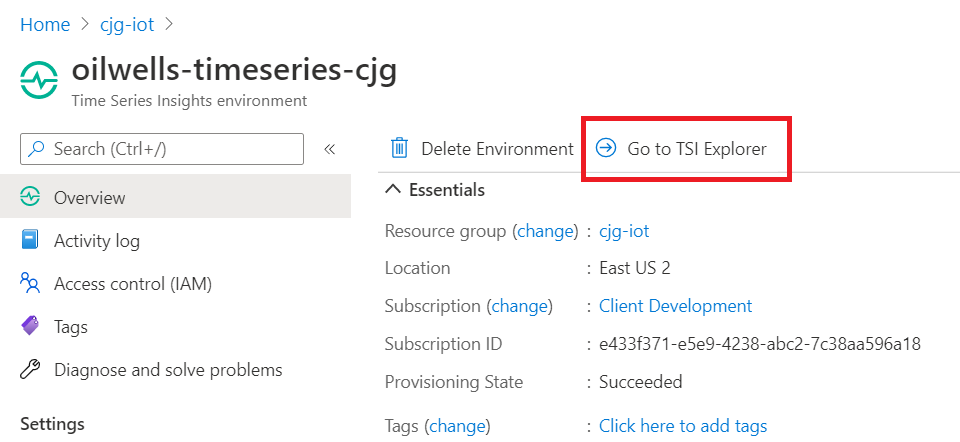
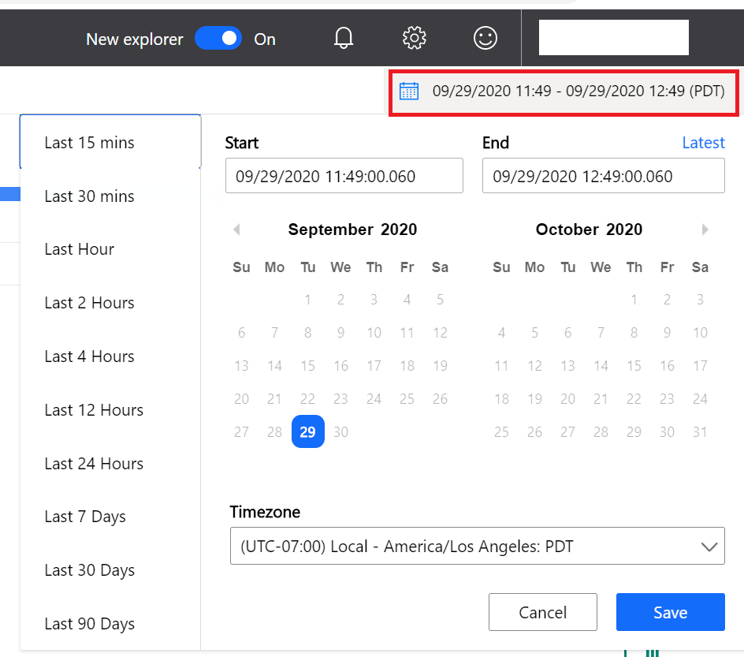
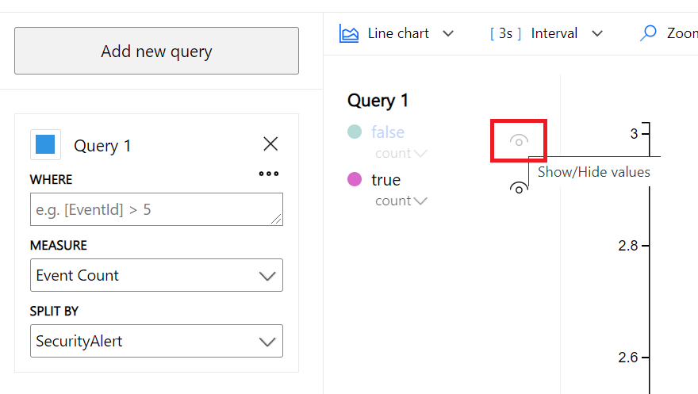

## Exercise 7: Device Messaging and Time Series Insights

Duration: 15 minutes

This exercise will walk you through integrating Time Series Insights and then sending security log messages from a simulated device.

### Task 1: Setup Time Series Insights

1. Switch to the Azure Portal, select the **iotsecurity-<inject key="DeploymentID" enableCopy="false"/>** resource group.

2. Select the **oilwells-timeseries-<inject key="DeploymentID" enableCopy="false"/>** Time Series Insights environment.

    

3. Under **Settings**, select **Event Sources**.

4. Select **+Add**.

    

5. For the name, type **oilwells-iothub-<inject key="DeploymentID" enableCopy="false"/>**.

6. For the source, select **Iot Hub**.

7. Select your **oilwells-iothub-<inject key="DeploymentID" enableCopy="false"/>** IoT Hub.

8. For the IoT hub policy name, select **iothubowner**

9. For the IoT hub consumer group, select **$default**

10. Select **Save**.

11. In the blade menu, select **Data Access Policies**.

12. Select **+Add**.

13. Select **Select user**, then search for your user account.

14. For the role, select **Reader** and **Contributor**.

15. Select **OK**.

16. Select **OK**.

### Task 2: Send Security Messages

1. Open the **\Hands-on-lab\simulated-device\simulated-device.sln** project.

2. From Solution explorer, open the **SimulatedDevice.cs** file.

    

3. Update the device connection string with your **oilwells001** device.

    

4. Review the code, notice it is simply creating a set of random event messages, some of which are security oriented.

5. Run the program, press **F5**.  Wait for this tool to run for 2-3 minutes.

### Task 3: Review the Time Series Portal

1. Switch to the Azure Portal.

2. Select the **iotsecurity-<inject key="DeploymentID" enableCopy="false"/>** resource group.

3. Select the **oilwells-timeseries-<inject key="DeploymentID" enableCopy="false"/>** Time Series Insights environment.

4. Select the **Go to TSI Explorer** link, close any dialogs.

    

5. Select **Add new query**

6. Select a `from` and `to` date settings that fit to the window you ran the device security message simulation, select **Save**

   

7. Select the **SPLIT BY** drop down, then select **SecurityAlert**.

8. In the filter, right-click the **Events/SecurityAlert/true** property, select **Show only this series**, you should now see all the custom message sent from the device(s) that were set to SecurityAlerts.

    

    
