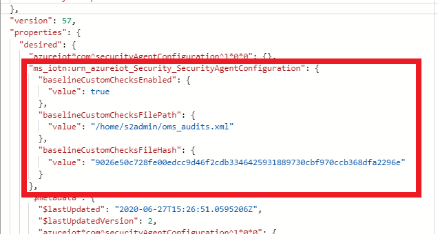
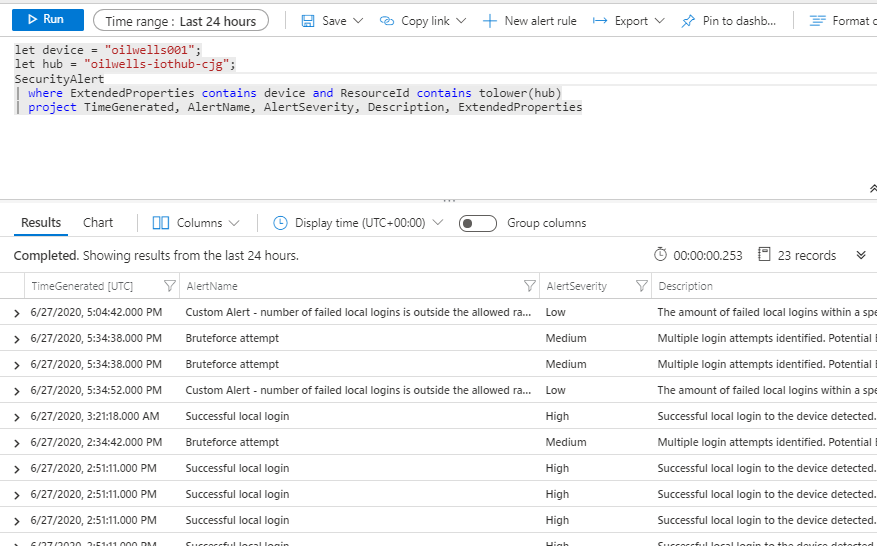
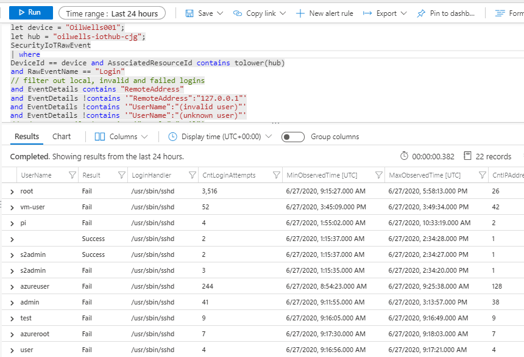

## Exercise 8: Configure security and alerts

Duration: 20 minutes

This exercise will evaluate the logs from when you enabled diagnostic logging on your Azure resources and then setup some alerts based on any important configuration changes that an Azure user may make to your IoT infrastructure.  You will also setup a baseline such that if a local user makes a change on your IoT Device, the security agent will make note of it and notify you.

### Task 1: Create IoT Baseline checks

1. Switch to the Azure Portal and your lab resource group.

2. Select the **oilwells-iothub-[YOUR INIT]** IoT Hub.

3. Under **Automatic Device Management**, select **IoT Edge**.

4. Select the **oilwells-edge-001** device.

5. Select the **azureiotsecurty** module.

6. Select the **Module Identity Twin** tab.

7. Find the `desired` section of the twin, add the `ms_iotn:urn_azureiot_Security_SecurityAgentConfiguration` property with the following:

    ```json
        "ms_iotn:urn_azureiot_Security_SecurityAgentConfiguration": {
            "baselineCustomChecksEnabled": {
            "value" : true
            },
            "baselineCustomChecksFilePath": {
            "value" : "/home/wsuser/oms_audits.xml"
            },
            "baselineCustomChecksFileHash": {
            "value" : "9026e50c728fe00edcc9d46f2cdb3346425931889730cbf970ccb368dfa2296e"
            }
        }
    ```

    > **Note**: You can use the [sha256sum](https://linux.die.net/man/1/sha256sum) tool in Linux to create a file hash.

    

8. Select **Save**.

9. Switch to your terminal/SSH/putty session connected to the **oilwells-edge-001** IoT Device, run the following commands:

    ```bash
    sudo nano /home/wsuser/oms_audit.xml
    ```

10. Copy and paste the local `/Hands-on lab/scripts/oms_audits.xml` or [remote](../Hands-on%20lab/Scripts/oms_audits.xml) file content into the session window, then save it.

### Task 2: Review Azure Security for IoT log data

1. Switch to the Azure Portal and your resource group.

2. Select the **oilwells-iothub-[YOUR INIT]** IoT Hub.

3. In the blade menu, in the **Security** section, select **Overview**, you will get a dashboard of potential security recommendations you should consider.

4. Under **Security**, select **Security Alerts**, you should see several alerts displayed.

5. Under **Security**, select **Recommendations**, you should see our attack items displayed.

    

    >**Note**: It may take 10-15 minutes for them to be displayed.

6. Select the **Device has open ports** recommendation.  In the dialog, select the **To see which devices have this recommendation...** link.  This will navigate to the Log Analytics portal when you can drill deeper into the log data that caused the alert.

7. Expand the log.

### Task 3: Create custom security alerts for device events

1. From the **oilwells-iothub-[YOUR INIT]** IoT Hub blade, in the **Security** section, select **Settings**, then select **Custom Alerts**.

2. Select the **default** security group.

3. Select **Create custom alert rule**.

    

4. Review the available options, then select **Number of failed local logins is not in allowed range**.

    

5. Select **OK**.

6. Select **Save**.  In addition to the custom alerts you can create, you will also see default ones fire such as successful logins.

    

### Task 4: Create custom security alerts for azure events

1. From the Azure Portal navigate back to your resource group, then select the **oilwells-logging-[YOUR INIT]** Log Analytics instance.

2. In the blade menu, in the **General** section, select **Logs**. If displayed, select **Get Started**, then dismiss the **Queries** dialog window.

    

3. In the query window, paste the following:

    ```SQL
    AzureActivity
    | where Resource == "oilwells-iothub-[YOUR INIT]"
    | limit 50
    | sort by TimeGenerated desc
    ```

4. Select **Run**, you may not see any results.

    

5. In the top navigation menu, select **+New alert rule**.

6. Select the condition, in the dialog, scroll to the **threshold value**, type **1**, select **Done**.

    

7. Select the **Add action groups** link, then select **Create action group**.

8. Select the **iotsecurity-\[your initials or first name\]** resource group.

9. For the action group name type **Email IoT Hub Admins**.

10. For the display name type **Email**.

11. Select **Next: Notifications**.

12. For the action type, select **Email/SMS Message/Push/Voice**.

13. For the action name, type **Email IoT Hub Admins**.

14. In the dialog that opens, check the **Email** checkbox, then type an email alias.

15. Select **OK**.

16. Select **Review + create**.

17. Select **Create**.

18. For the **Alert rule name**, type **IoT Hub Modified**.

19. For the **description**, type **The IoT Hub was modified**.

    

20. Select **Create alert rule**.

21. Make a change to your IoT Hub such as adding a user as an owner. You will receive an email alert after a few minutes notifying you of the change.

    

22. From the Azure Portal navigate back to your resource group, then select the **oilwells-logging-[YOUR INIT]** Log Analytics workspace instance.

23. In the blade menu, in the **General** section, select **Logs**.

24. In the query window, paste the following:

    ```SQL
    AzureDiagnostics
    | where ( ResourceType == "IOTHUBS" and Category == "Connections" and Level == "Error")
    ```

    - Common connection errors include:

        - [404104 DeviceConnectionClosedRemotely](https://docs.microsoft.com/en-us/azure/iot-hub/iot-hub-troubleshoot-error-404104-deviceconnectionclosedremotely)
        - [401003 IoTHubUnauthorized](https://docs.microsoft.com/en-us/azure/iot-hub/iot-hub-troubleshoot-error-401003-iothubunauthorized)
        - [409002 LinkCreationConflict](https://docs.microsoft.com/en-us/azure/iot-hub/iot-hub-troubleshoot-error-409002-linkcreationconflict)
        - [500001 ServerError](https://docs.microsoft.com/en-us/azure/iot-hub/iot-hub-troubleshoot-error-500xxx-internal-errors)
        - [500008 GenericTimeout](https://docs.microsoft.com/en-us/azure/iot-hub/iot-hub-troubleshoot-error-500xxx-internal-errors)

25. Select **Run**, you may not see any results.

26. In the top navigation menu, select **New alert rule**.

27. Select the condition, in the dialog, scroll to the **threshold value**, type **1**, select **Done**.

    

28. Select **Select action group**.

29. Select the **Email IoT Hub Admins** group, then select **Select**.

30. For the **Alert rule name**, type **Device is missing**.

31. For the **description**, type **A device is missing**.

    

32. Select **Create alert rule**.

### Task 5: Send a DirectMethod

1. In the Azure Portal, browse to the Iot Hub.

2. Under **Automatic Device Management**, select **Iot Edge**.

3. Select the **oilwells-edge-001** device.

4. Select the **$edgeAgent** module.

5. In the top menu, select **Direct Method**.

6. For the method name, type **ping**.

7. For the **Payload**, type **0**.

8. In the top navigation, select **Invoke Method**, in the **Result** text area you should see the following:

    ```json
    {"status":200,"payload":null}
    ```

    > **Note**: If you do not get a response, you may need to restart the `iotedge` service on the device.

    - `<=1.1.4`

        ```bash
        sudo systemctl restart iotedge
        sudo systemctl status iotedge
        ```

    - `>=1.2`

        ```bash
        sudo iotedge config apply
        ```

    - `all`

        ```bash
        sudo systemctl restart ASCIoTAgent
        sudo systemctl status ASCIoTAgent
        ```

### Task 6: Device Investigation with Logs

1. From the Azure Portal navigate back to your resource group, then select the **oilwells-logging-[YOUR INIT]** Log Analytics instance.

2. In the blade menu, in the **General** section, select **Logs**.

    

3. In the query window, paste the following replacing the device id (`oilwells-edge-001`) and the hub name (`oilwells-iothub-[INIT]`) to find all security alerts for a device:

    ```kusto
    let device = "YOUR_DEVICE_ID";
    let hub = "YOUR_HUB_NAME";
    SecurityAlert
    | where ExtendedProperties contains device and ResourceId contains tolower(hub)
    | project TimeGenerated, AlertName, AlertSeverity, Description, ExtendedProperties
    ```

    

4. Highlight the query, then select **Run**. Review the results.

5. In the query window, paste the following replacing the device id (`oilwells-edge-001`) and the hub name (`oilwells-iothub-[INIT]`) to find all failed logins to a device:

    ```kusto
    let device = "YOUR_DEVICE_ID";
    let hub = "YOUR_HUB_NAME";
    SecurityIoTRawEvent
    | where
        DeviceId == device and AssociatedResourceId contains tolower(hub)
        and RawEventName == "Login"
        // filter out local, invalid and failed logins
        and EventDetails contains "RemoteAddress"
        and EventDetails !contains '"RemoteAddress":"127.0.0.1"'
        and EventDetails !contains '"UserName":"(invalid user)"'
        and EventDetails !contains '"UserName":"(unknown user)"'
        //and EventDetails !contains '"Result":"Fail"'
    | project
        TimestampLocal=extractjson("$.TimestampLocal", EventDetails, typeof(datetime)),
        UserName=extractjson("$.UserName", EventDetails, typeof(string)),
        LoginHandler=extractjson("$.Executable", EventDetails, typeof(string)),
        RemoteAddress=extractjson("$.RemoteAddress", EventDetails, typeof(string)),
        Result=extractjson("$.Result", EventDetails, typeof(string))
    | summarize CntLoginAttempts=count(), MinObservedTime=min(TimestampLocal), MaxObservedTime=max(TimestampLocal), CntIPAddress=dcount(RemoteAddress), IPAddress=makeset(RemoteAddress) by UserName, Result, LoginHandler
    ```

    

    > **Note**: Are you surprised by the results? Having a device on the internet provides opportunity for bad actors to gain access to your device!

6. Highlight the query, then select **Run**. Review the results.

7. If you would like to get logs from Azure Sentinel or Log analytics for **Azure Defender for IoT**, you can run the following query:

    ```kql
    SecurityAlert | where ProductName == "Azure Security Center for IoT"
    ```
