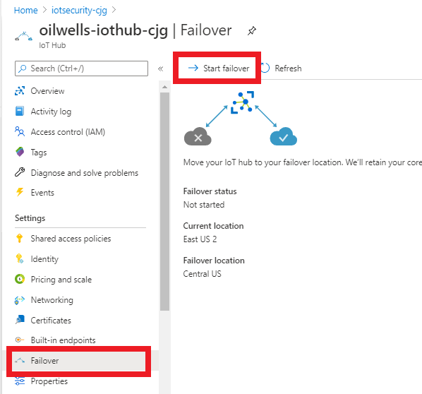

## Exercise 8: Perform an IoT Hub Manual Failover

Duration: 10 minutes

This exercise will have you perform an IoT Hub failover to a different region.

### Task 1: Perform a manual failover

1. Open the Azure Portal.

2. In the resource group **iotsecurity-<inject key="DeploymentID" enableCopy="false"/>**, Select **oilwells-iothub-<inject key="DeploymentID" enableCopy="false"/>** IoT Hub .

3. In the blade menu, in the **Settings** section, select **Failover**.

4. In the top menu, select **Start Failover**.

    

5. Type your IoT Hub name, then select **Failover**.  It can take several minutes to failover the IoT Hub.

    

