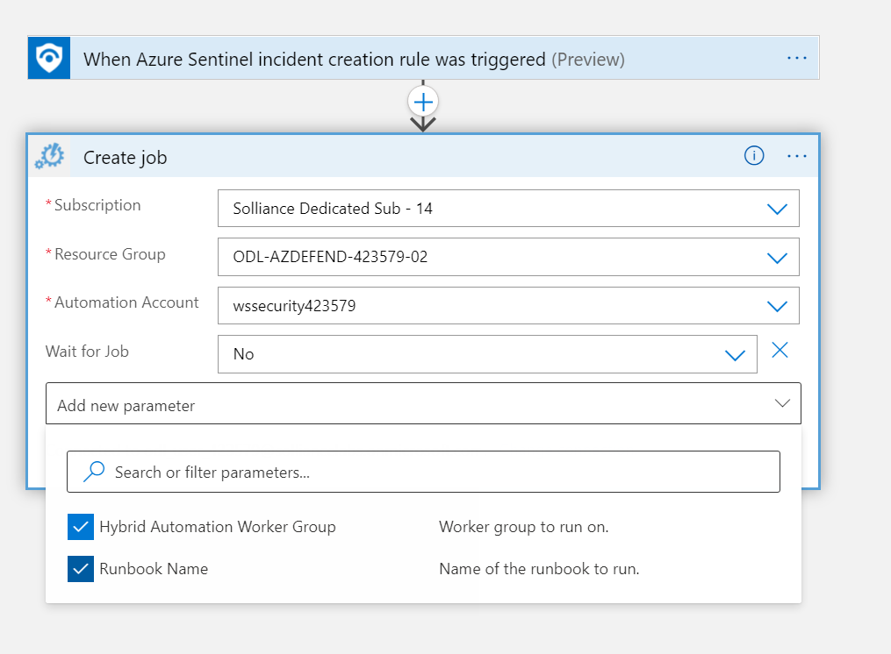
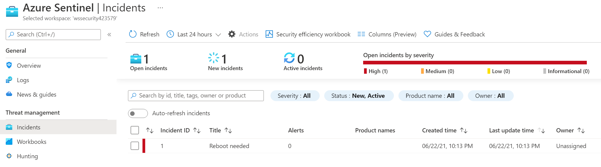

## Exercise 9: Azure Sentinel Hunting

Duration: 30 minutes

This exercise will show you how to query with Azure Sentinel and deploy remediation scripts to IoT Devices based on query alerts.

### Task 1: Azure Sentinel Configuration

1. Switch back to the Azure Portal.
2. In the global search, search for **Azure Sentinel**, select it.

    

3. Select **Create**.
4. Select the **oilwells-logging-[YOUR INIT]** log analytics workspace.
5. Select **Add**.
6. Under configuration, select **Data connectors**.
7. Search for **IoT**.

    

8. Select **Azure Defender for IoT**, then select **Open connector page**.
9. For your lab subscription, select **Connect**.
10. For the **Create incidents**, select **Enable**.
11. Browse back to Azure Sentinel.
12. Search for **Microsoft Defender for EndPoint**, then select **Open connector page**.
13. Select **Connect**.
14. For the **Create incidents**, select **Enable**.
15. Browse back to Azure Sentinel.

### Task 2: Create Linux Hybrid Worker

1. On the **Win10** virtual machine, open a PowerShell window, run the following, be sure to replace the value to match your lab environment:

    ```PowerShell
    Connect-AzAccount

    Set-AzOperationalInsightsIntelligencePack -ResourceGroupName <resourceGroupName> -WorkspaceName <workspaceName> -IntelligencePackName "AzureAutomation" -Enabled $true
    ```

    > **Note** You may need to switch to the target subscription if you have more than one.

2. Switch to the Azure Portal.
3. Browse to the **oilwells-automation-INIT** Automation Account.

    

4. Under **Configuration Management**, select **Inventory**.
5. Select **Enable**.
6. Under **Update Management**, select **Update management**.
7. Select **Enable**.
8. Under **Account Settings**, select **Keys**, copy the primary access key and the URL.

    

9. Switch to the **oilwells-edge-001** virtual machine SSH session.

10. Run the following commands to add the VM to a Hybrid worker, be sure to replace the values to match your environment.  Set the **hybridGroupName** to "IoTEdge":

    ```PowerShell
    sudo /opt/microsoft/omsagent/bin/service_control restart <YOUR_WORKSPACE_ID>

    sudo python /opt/microsoft/omsconfig/modules/nxOMSAutomationWorker/DSCResources/MSFT_nxOMSAutomationWorkerResource/automationworker/scripts/onboarding.py --register -w <YOUR_WORKSPACE_ID> -k <automationSharedKey> -g <hybridGroupName> -e <automationEndpoint>
    ```

11. Switch back to the Automation Account.
12. Under **Process Automation**, select **Hybrid worker groups**, you should now see the **IoTEdge** group displayed.

    

13. Under **Process Automation**, select **Runbooks**.
14. Select **Create a runbook**.
15. For the name, type **Reboot**.
16. For the type, select **Python 3**.
17. Select **Create**.
18. In the script window, copy the following:

    ```PowerShell
    sudo reboot
    ```

19. Select **Save**.
20. Select **Publish**, in the dialog, select **Yes**.

### Task 3: Create a Logic App

1. Browse back the Azure Portal.
2. In the global search, search for **Logic Apps**, select it.
3. Select **+Add**.
4. Select the lab subscription and resource group.
5. For the type, select **Consumption**.
6. For the name, type **Reboot**.
7. Select the **Enable log analytics** checkbox.
8. Select the **oilwells-logging-INIT** log analytics workspace.
9. Select **Review + create**.
10. Select **Create**, once it is created, select **Go to resource**.
11. Select **Blank Logic App**.
12. For the trigger, select **When Azure Sentinel incident creation rule was triggered**.
13. Select **Sign in**.
14. Select the **+** button in the workspace, then select **Add an action**.
15. Search for **Create job** in the **Azure Automation** namespace.
16. Select it, then select **Sign in**.
17. Select the lab subscription and resource group.
18. Select the automation account.
19. Add the Hybrid Automation Worker Group parameter, set to `IoTEdge`.
20. Add the Runbook Name parameter, select **Reboot**.

    

21. Select **Save**

### Task 4: Configure an Alert / Incident

1. Switch to the Azure Portal and Azure Sentinel.
2. Select the log analytics workspace if needed.
3. Under **Configuration**, select **Automation**.
4. Select **Create->Add new rule**.
5. For the name, type **Reboot**.
6. For the actions, select **Run playbook**.
7. Select the **Manage playbook permissions** link.

    

8. Select the lab resource group.
9. Select **Apply**.
10. Select the **Reboot** playbook.
11. Select **Apply**.

    

### Task 5: Manually create an Incident

1. Open the `\Hands-on lab\Scripts\CreateIncident.ps1` in Windows PowerShell ISE.
2. Update the values in the script, press **F5** to run it.
3. Browse back to Azure Portal and Azure Sentinel.
4. Select **Incidents**, you should see a new incident.

    

5. As part of the incident, you will see that the runbook has executed and thus, the worker in the run group will reboot.
