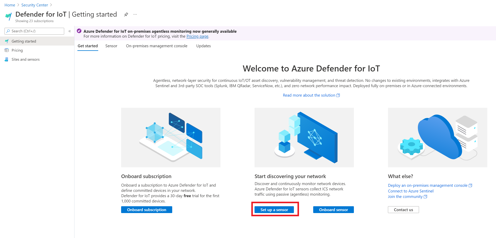
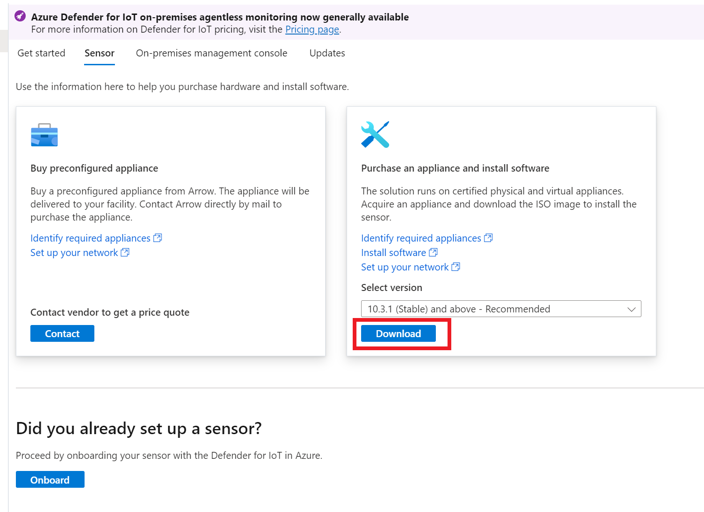
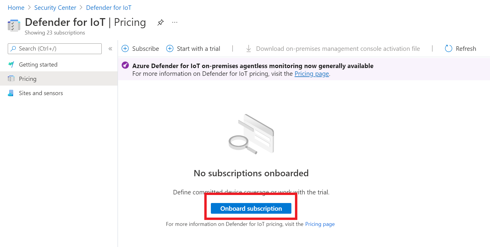

## Exercise 10: Azure Defender for IoT (Optional)

Duration: 30-120 minutes

This exercise will show you how to install the Azure Defender for IoT agent and management console.

### Task 1: Install Azure Defender for IoT Sensor (Pre-built)

1. Due to the nature of the software and the install process, this can take up to 60 minutes to complete, if this is a route you'd like to take, move to Task 2.
2. You can simply start the **IoT Sensor** image and preform the following instead:

    - You will need to get the IP address of the host machine. Run `ipconfig` on the windows 10 host. Copy the IP address, this will become your `gateway IP`.
    - Switch to the `oilwells-edge-001` device.
    - Run `ifconfig`, copy the IP address and the subnet.
    - Start the VM.
    - Login using `support` with password `S2@dmins2@dmin123`.
    - Run the following command.

    ```bash
    network edit-settings
    ```

    - For the IP address, add `15` to the server IP host value.
    - For the subnet, copy the subnet you output above.
    - Set the DNS to `8.8.8.8`.
    - For the gateway enter the Windows 10 host IP.
    - Leave all other values, the image will reboot.
    - On the Windows 10 host, open an Edge browser window to the IP Address you gave the console. If prompted, select **Show advanced**, and then select **Proceed to IP ADDRESS (unsafe)**.
    - Login using `cyberx` with password `S2@dmins2@dmin123`.
    - Explore the sensor dashboard and pages.

### Task 2: Install Azure Defender for IoT Sensor (From scratch)

1. Login to the **win10** virtual machine.
2. Open the Azure Portal.
3. Browse to the **Security Center** portal.
4. Under **Cloud Security**, select **Azure Defender**, then select **IoT Security** to open the **Azure Defender for IoT** portal.
5. Select **Set up a sensor**.

    

6. Select the **10.3.1 (Stable) and above** sensor, then select **Download**

    

7. Select **Continue without submitting**.
8. Open the **Hyper-V manager** management console.
9. Select the local server.
10. Select **New->Virtual Machine**.
11. Select **Next**.
12. For the name, type **IoT Sensor**.
13. Select **Next**.
14. Select **Generation 2**, select **Next**.
15. Leave the memory setting at **2048**, select **Next**.
16. For the connection, select **Default switch**, select **Next**.
17. On the hard disk dialog, select **Next**.
18. Select the **install an operating system from a bootable image file**, browse to the downloaded **sensor** ISO.
19. Select **Next**.
20. Select **Finish**.
21. Select **Settings**, then select **Add hardware**.
22. Select **Network Adapter**, then select **Add**.
23. Select **Processor**, for number of virtual processors, type **2**.
24. Select **OK**.
25. Select the new virtual machine, then select **Start**.
26. Right-click the virtual machine, select **Connect**.
27. In the setup, select your language, press **Enter**.
28. Select the **sensor-X.X.X.X-buildEnterprise** version, press **Enter**.  The software image will start to install.

    > **Note** This can take up to 20 mins to complete

29. Once the virtual machine is booted, select the `eth0` network interface, press **Enter**.
30. For the IP address, type **192.168.102.7**.
31. For the subnet mask, type **255.255.255.0**.
32. For the DNS, type **192.168.102.5**.
33. Type **Y**, press **Enter**.
34. Once all the updates and configuration is complete, record your `cyberx` login information then press **Enter**.
35. Record your `support` login information then press **Enter**.
36. Once the system restarts, open a web browser to the sensor console IP address.
37. Login using the `cyberx` login and password..
38. You will be prompted for the activation file which you will populate in the following tasks.

### Task 3: Install Azure Defender for IoT Management Console (Pre-Built)

1. Due to the nature of the software and the install process, this can take up to 60 minutes to complete, if you'd like to perform this lengthy task, jump to task 4 to do the manual install.
2. You can simply start the **IoT Management Console** image and preform the following instead:

    - You will need to get the IP address of the host machine. Run `ipconfig` on the windows 10 host. Copy the IP address, this will become your `gateway IP`.
    - Switch to the **oilwells-edge-001** device.
    - Run `ifconfig`, copy the IP address and the subnet.
    - Start the VM.
    - Login using `cyberx` with password `S2@dmins2@dmin`.
    - Run the following command.

    ```bash
    sudo cyberx_management_network_reconfigure
    ```

    - For the IP address, add `10` to the server IP host value.
    - For the subnet, copy the subnet you output above.
    - Set the DNS to `8.8.8.8`.
    - For the gateway enter the Windows 10 host IP.
    - Leave all other values, the image will reboot.
    - On the Windows 10 host, open an Edge browser window to the IP Address you gave the console.

### Task 4: Install Azure Defender for IoT Management Console (Manual)

1. Switch back to the Azure Portal and the Azure Defender for IoT page.
2. If the download dialog is displayed, select **Close**.
3. In the top navigation, select **On-premises management console**.
4. Select the **10.3.1 (Stable) and above** sensor, then select **Download**.
5. Open the **Hyper-V manager** management console.
6. Select the local server.
7. Select **New->Virtual Machine**.
8. Select **Next**.
9. For the name, type **IoT Console Manager**.
10. Select **Next**.
11. Select **Generation 2**, select **Next**.
12. Leave the memory at **2048**, select **Next**.
13. For the connection, select **Default switch**, select **Next**.
14. On the hard disk dialog, select **Next**.
15. Select the **install an operating system from a bootable image file**, browse to the downloaded **console manager** ISO.
16. Select **Next**.
17. Select **Finish**.
18. Select **Settings**, then select **Processor**, for number of virtual processors, type **2**.
19. Select **OK**.
20. Select the new virtual machine, then select **Start**.
21. Right-click the virtual machine, select **Connect**.
22. In the setup, select your language, press **Enter**.
23. Select the **sensor-X.X.X.X-buildEnterprise** version, press **Enter**.  The software image will start to install.

    > **Note** This can take up to 20 mins to complete

24. Once the virtual machine is booted, type **enterprise** for the hardware profile, then press **Enter**.
25. For the management network interface, select `eth0`, press **Enter**.
26. For the IP address, type **192.168.102.50**.
27. For the DNS, type **192.168.102.5**.
28. For the gateway, type **192.168.102.1**.
29. For the input interface, type **eth1**.
30. For the bridge interface, type **eth0**.
31. Type **Y**, press **Enter**.
32. Once all the updates and configuration is complete, record your `cyberx` login information then press **Enter**.
33. Record your `support` login information then press **Enter**.
34. Once the system restarts, open a web browser to the management console IP Address.
35. Login using the `cyberx` login and password.
36. Select the **Use a locally generated self signed certificate...** option, select select **I Confirm**.
37. Select **NEXT**.
38. Select **FINISH**.

### Task 5: Onboard subscription

1. Switch back to the Azure Portal and the Azure Defender for IoT page.
2. Select **Pricing**.
3. Select **Onboard subscription**.

    

4. Select the lab subscription.
5. Select **Subscribe**, in the dialog select **Confirm**.

> **Note** An onboarded subscription is free for the first 30 days, then is [charged at $2000/month](https://azure.microsoft.com/en-us/pricing/details/azure-defender/) per 1000 devices.  Be sure that you deallocate your subscription when done!

### Task 6: Onboard a Sensor

1. Switch back to the Azure Portal and the Azure Defender for IoT page.
2. Select **Sites and Sensors**.
3. Select **Onboard sensor**.
4. For the name, type **sensor-001**.
5. Select your lab subscription.
6. Select your IoT Hub.
7. For the site name, type **default**.
8. Select **Register**.
9. Select **Download activation file**.
10. Switch to your sensor browser session.
11. Select **Upload**, then select **Browse File..**.
12. Select the **sensor-001_license.zip** file you just downloaded.
13. Select the **Approve these Terms and Conditions** check box.
14. Select **Activate**, in the dialog select **OK**.
15. Select the **Use a locally generated self signed certificate...** option, select select **I Confirm**.
16. Select **NEXT**.
17. Select **FINISH**, your sensor is now ready to monitor network traffic and send data to Azure.
